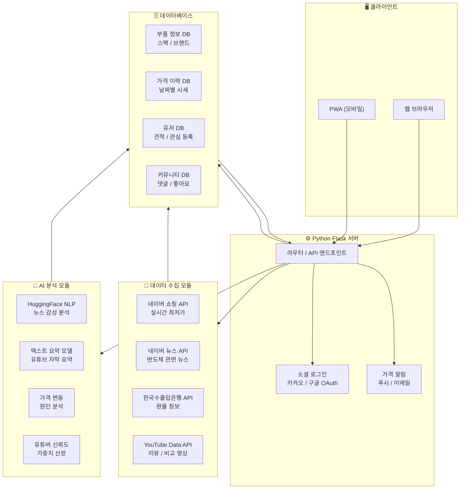
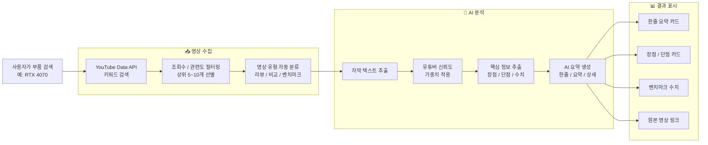
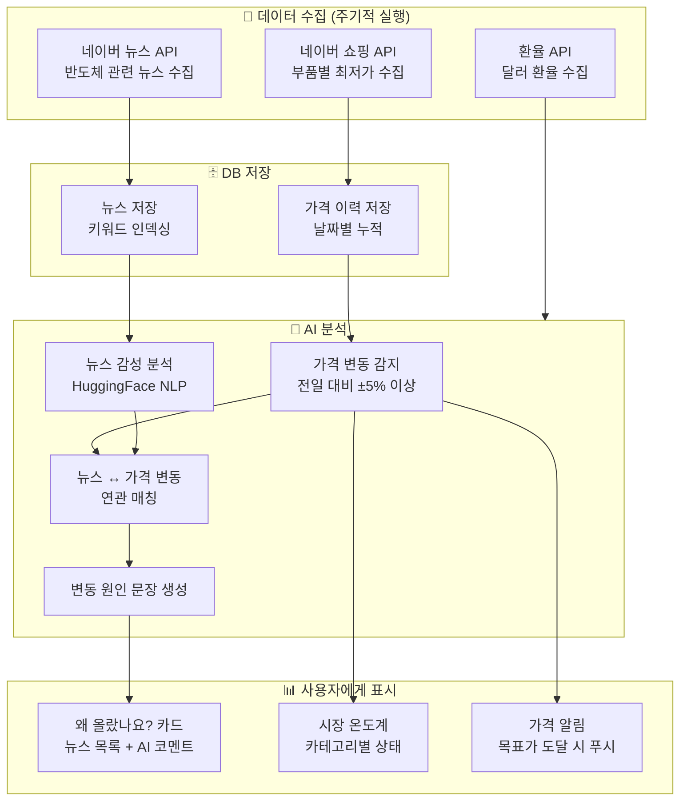
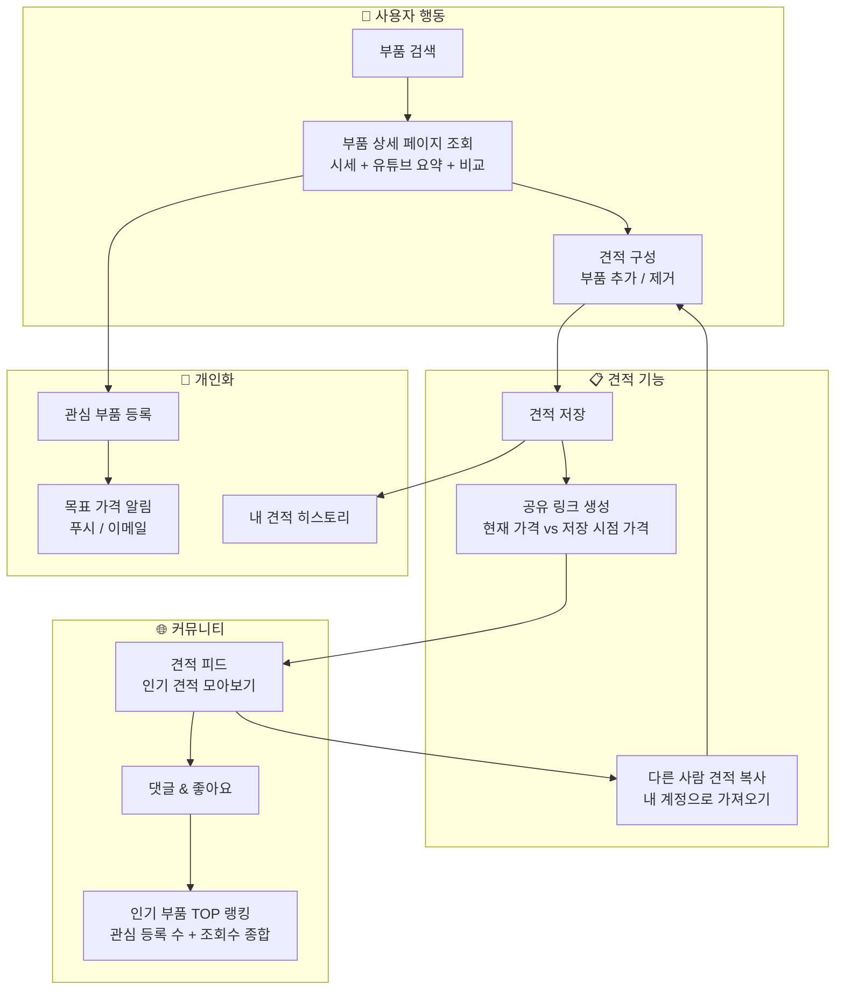
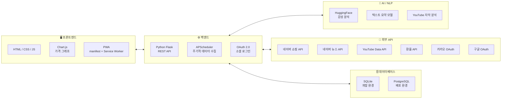
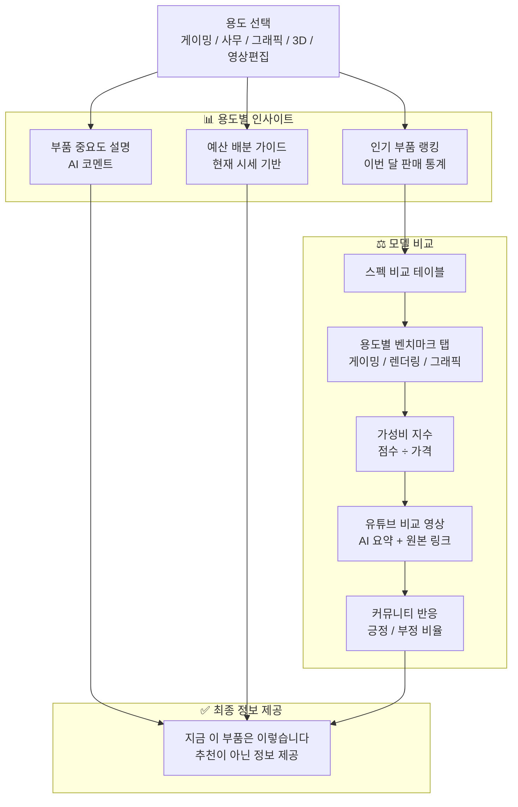

# 견피티 (GeonPiTi) 시스템 블럭도

---

## 1. 시스템 전체 아키텍처

---

## 2. 핵심 기능 - 유튜브 AI 분석 파이프라인

---

## 3. 가격 변동 원인 분석 파이프라인

---

## 4. 견적 구성 & 커뮤니티 흐름

---

## 5. 기술 스택 구성도

---

## 6. 용도별 인사이트 & 모델 비교 흐름

