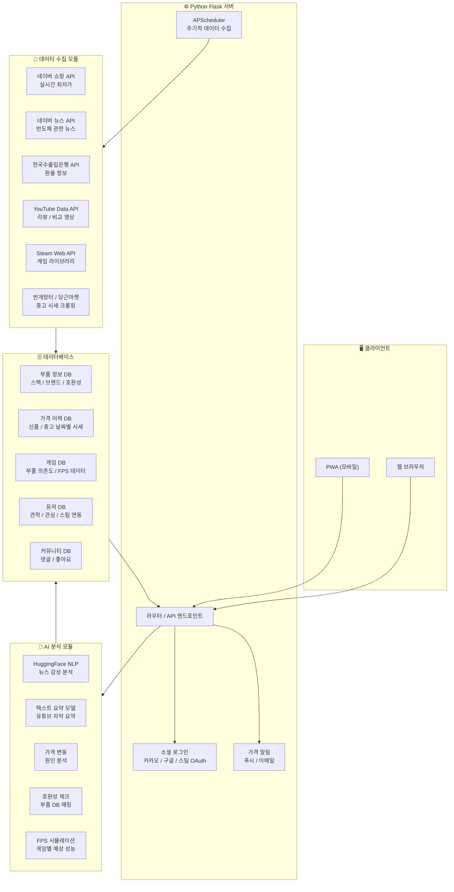
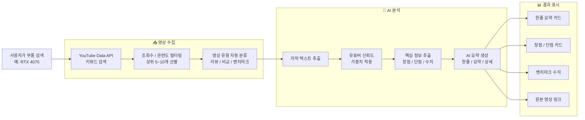
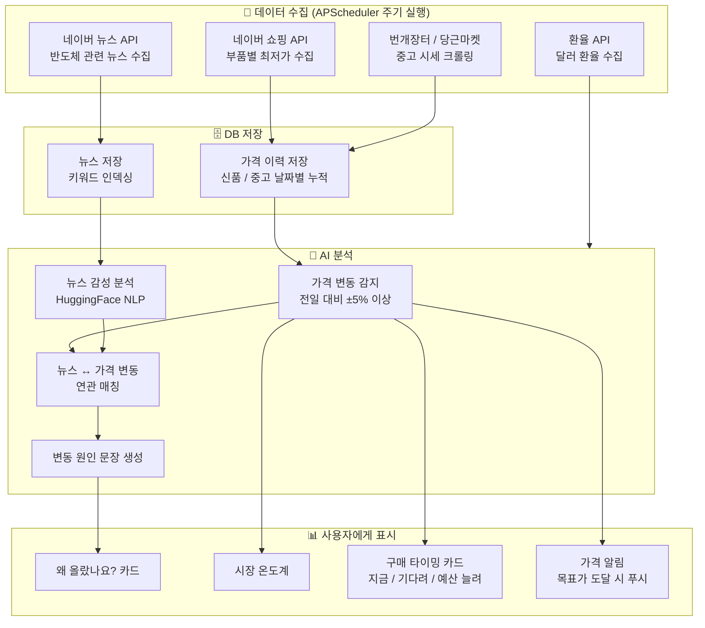
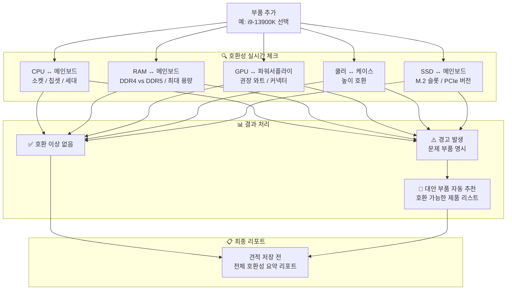
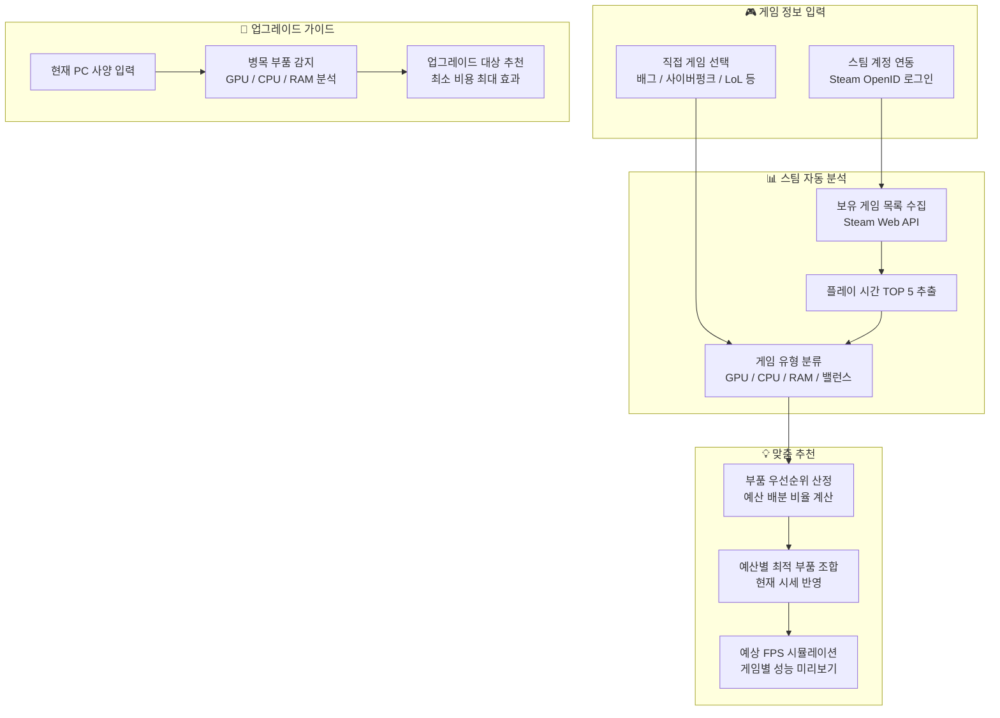
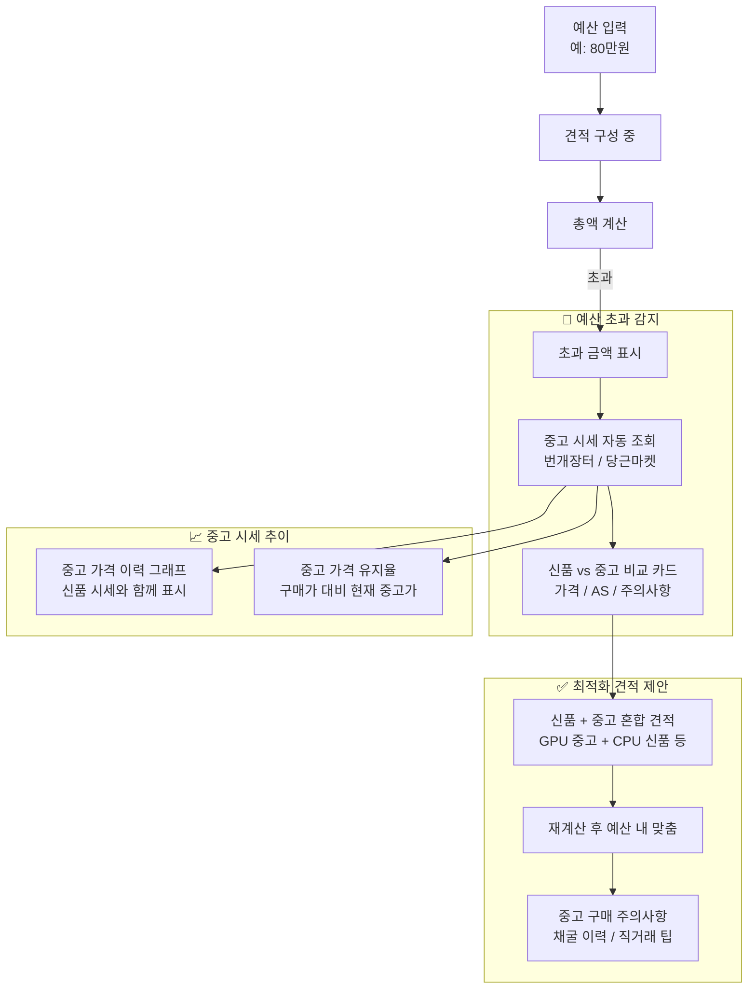
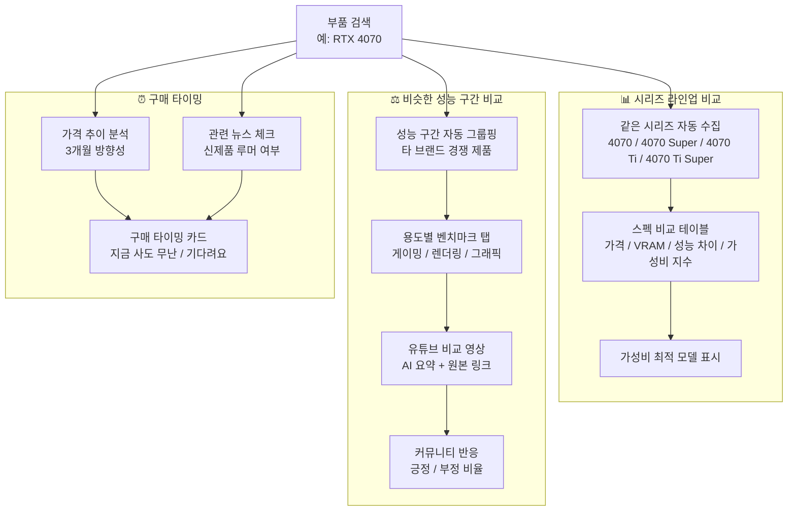
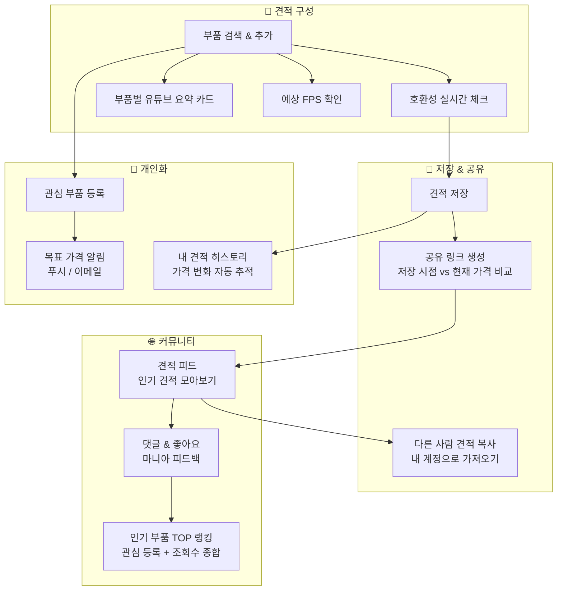

# 견피티 (GeonPiTi) 시스템 블럭도

---

## 1. 시스템 전체 아키텍처

---

## 2. 핵심 기능 - 유튜브 AI 분석 파이프라인

---

## 3. 가격 변동 원인 분석 파이프라인

---

## 4. 호환성 자동 체크 플로우

---

## 5. 게임별 맞춤 추천 & 스팀 연동

---

## 6. 예산 초과 시 중고 시세 연동

---

## 7. 시리즈 & 모델 비교 흐름

---

## 8. 커뮤니티 & 견적 공유 흐름

---

## 9. 기술 스택 구성도

```mermaid
flowchart LR
    subgraph FRONTEND["🖥️ 프론트엔드"]
        HTML["HTML / CSS / JS"]
        CHARTJS["Chart.js\n가격 그래프"]
        PWA2["PWA\nmanifest + Service Worker"]
    end

    subgraph BACKEND["⚙️ 백엔드"]
        FLASK["Python Flask\nREST API"]
        APSCHEDULER["APScheduler\n주기적 데이터 수집"]
        OAUTH["OAuth 2.0\n카카오 / 구글 / 스팀"]
    end

    subgraph AI_STACK["🤖 AI / NLP"]
        HF["HuggingFace\n감성 분석"]
        SUMMARIZER["텍스트 요약 모델\n유튜브 자막"]
        COMPAT_AI["호환성 매칭\n부품 DB 룰 기반"]
        FPS_AI["FPS 시뮬레이터\n벤치마크 DB 기반"]
    end

    subgraph EXTERNAL["📡 외부 API"]
        N_SHOP["네이버 쇼핑 API"]
        N_NEWS["네이버 뉴스 API"]
        YT["YouTube Data API"]
        EX["환율 API"]
        STEAM_API["Steam Web API"]
        USED_CRAWL["번개장터/당근 크롤링"]
    end

    subgraph DATABASE["🗄️ 데이터베이스"]
        PARTS_D["부품 / 호환성 DB"]
        PRICE_D["가격 이력 DB\n신품 + 중고"]
        GAME_D["게임 / FPS DB"]
        USER_D["유저 / 커뮤니티 DB"]
    end

    FRONTEND <--> BACKEND
    BACKEND <--> AI_STACK
    BACKEND <--> EXTERNAL
    BACKEND <--> DATABASE
    EXTERNAL --> DATABASE
```

