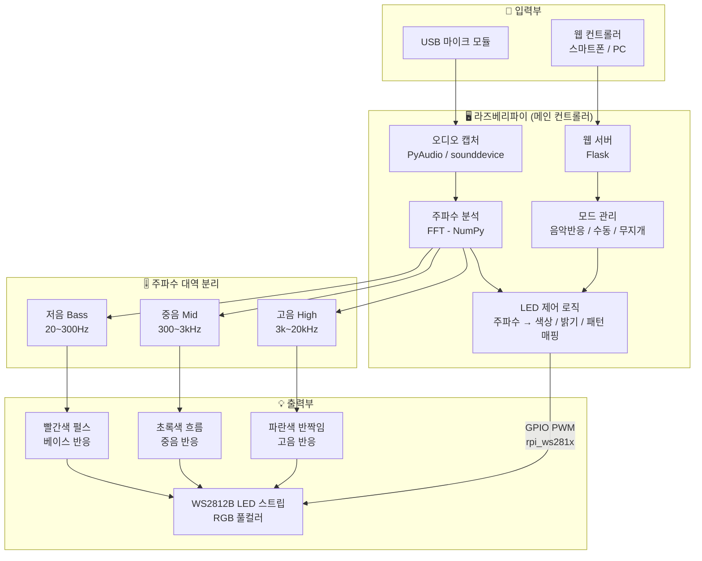
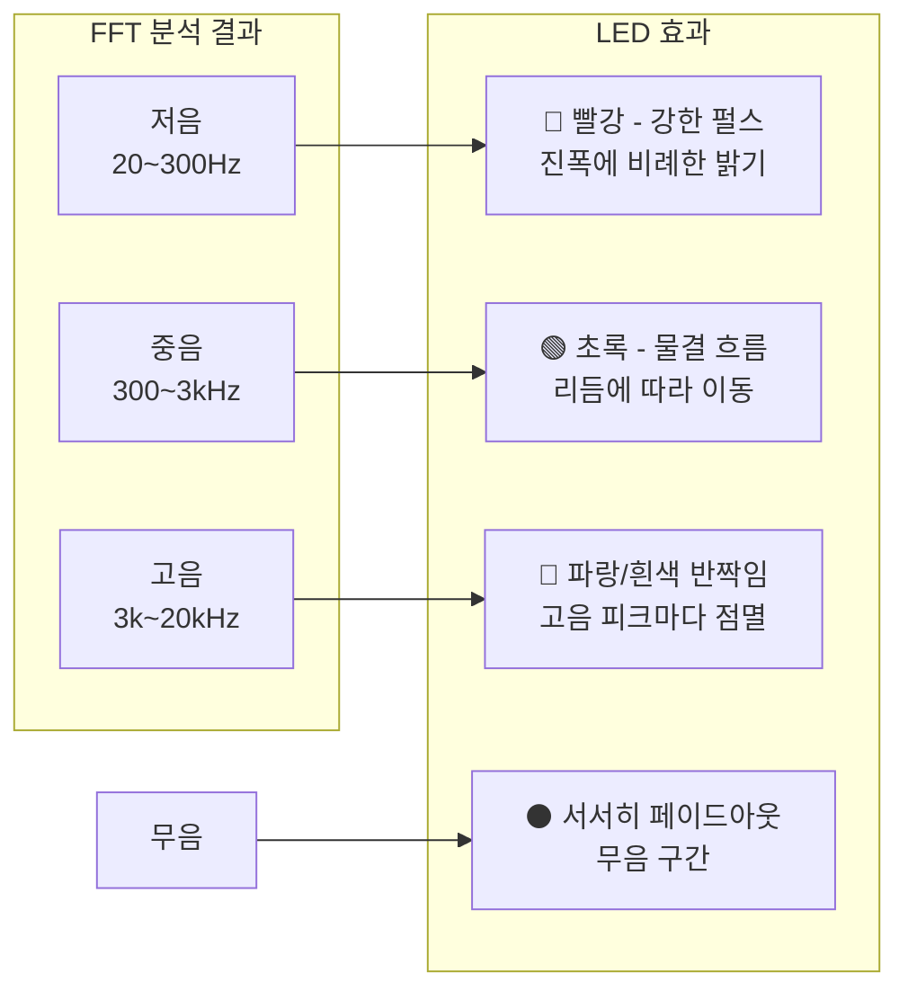
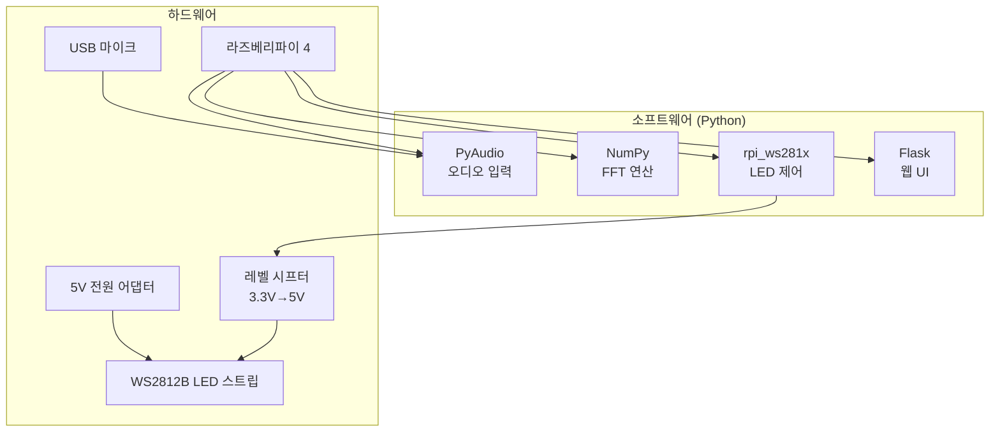

# 리듬에 반응하는 LED 조명 인터랙션 시스템
## 시스템 블럭도

```mermaid
flowchart TD
    subgraph INPUT["🎵 입력부"]
        MIC[USB 마이크 모듈]
        WEB[웹 컨트롤러\n스마트폰 / PC]
    end

    subgraph RPI["🖥️ 라즈베리파이 (메인 컨트롤러)"]
        direction TB
        AUDIO[오디오 캡처\nPyAudio / sounddevice]
        FFT[주파수 분석\nFFT - NumPy]
        LOGIC[LED 제어 로직\n주파수 → 색상 / 밝기 / 패턴 매핑]
        FLASK[웹 서버\nFlask]
        MODE[모드 관리\n음악반응 / 수동 / 무지개]

        AUDIO --> FFT
        FFT --> LOGIC
        FLASK --> MODE
        MODE --> LOGIC
    end

    subgraph FREQ["🎚️ 주파수 대역 분리"]
        LOW[저음 Bass\n20~300Hz]
        MID[중음 Mid\n300~3kHz]
        HIGH[고음 High\n3k~20kHz]
    end

    subgraph OUTPUT["💡 출력부"]
        LED[WS2812B LED 스트립\nRGB 풀컬러]
        RED[빨간색 펄스\n베이스 반응]
        GREEN[초록색 흐름\n중음 반응]
        BLUE[파란색 반짝임\n고음 반응]
    end

    MIC --> AUDIO
    WEB --> FLASK

    FFT --> LOW
    FFT --> MID
    FFT --> HIGH

    LOW --> RED
    MID --> GREEN
    HIGH --> BLUE

    RED --> LED
    GREEN --> LED
    BLUE --> LED

    LOGIC -->|GPIO PWM\nrpi_ws281x| LED
```

---

## 주파수 → LED 매핑 상세

```mermaid
flowchart LR
    subgraph ANALYSIS["FFT 분석 결과"]
        B[저음\n20~300Hz]
        M[중음\n300~3kHz]
        H[고음\n3k~20kHz]
    end

    subgraph EFFECT["LED 효과"]
        E1["🔴 빨강 - 강한 펄스\n진폭에 비례한 밝기"]
        E2["🟢 초록 - 물결 흐름\n리듬에 따라 이동"]
        E3["🔵 파랑/흰색 반짝임\n고음 피크마다 점멸"]
        E4["⚫ 서서히 페이드아웃\n무음 구간"]
    end

    B --> E1
    M --> E2
    H --> E3
    SILENCE[무음] --> E4
```

---

## 개발 구성 스택

```mermaid
flowchart TD
    subgraph HW["하드웨어"]
        RPI2[라즈베리파이 4]
        UMIC[USB 마이크]
        LEDS[WS2812B LED 스트립]
        LSH[레벨 시프터\n3.3V→5V]
        PWR[5V 전원 어댑터]
    end

    subgraph SW["소프트웨어 (Python)"]
        PA[PyAudio\n오디오 입력]
        NP[NumPy\nFFT 연산]
        WS[rpi_ws281x\nLED 제어]
        FL[Flask\n웹 UI]
    end

    RPI2 --> PA
    RPI2 --> NP
    RPI2 --> WS
    RPI2 --> FL
    UMIC --> PA
    WS --> LSH
    LSH --> LEDS
    PWR --> LEDS
```
