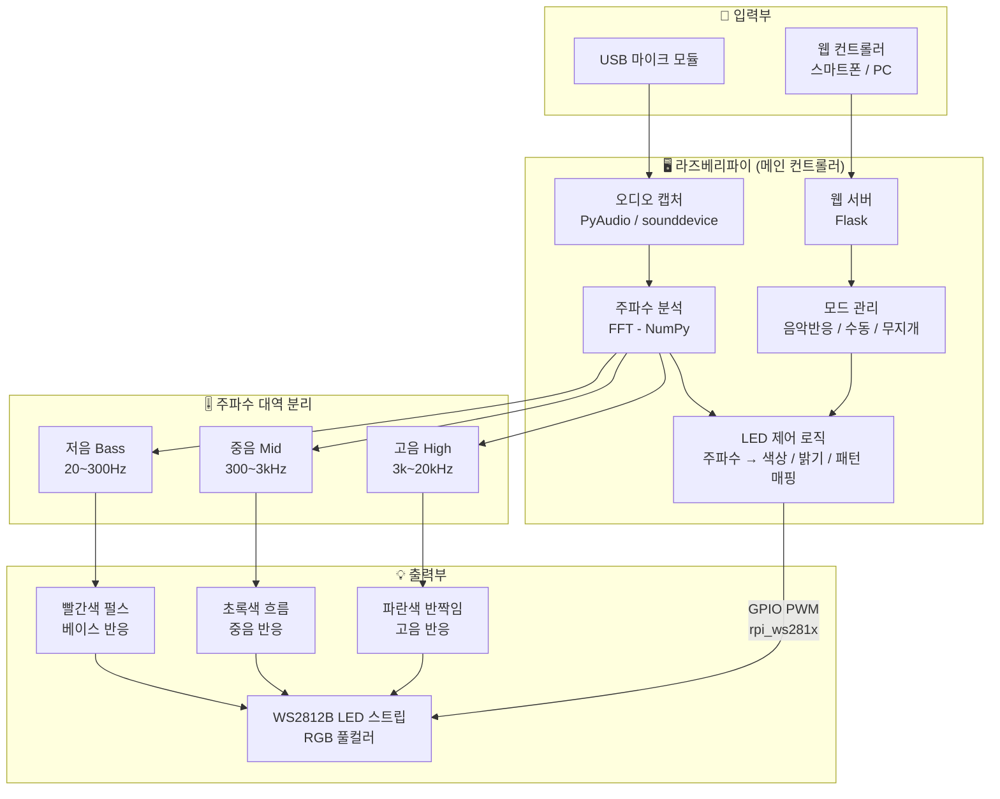
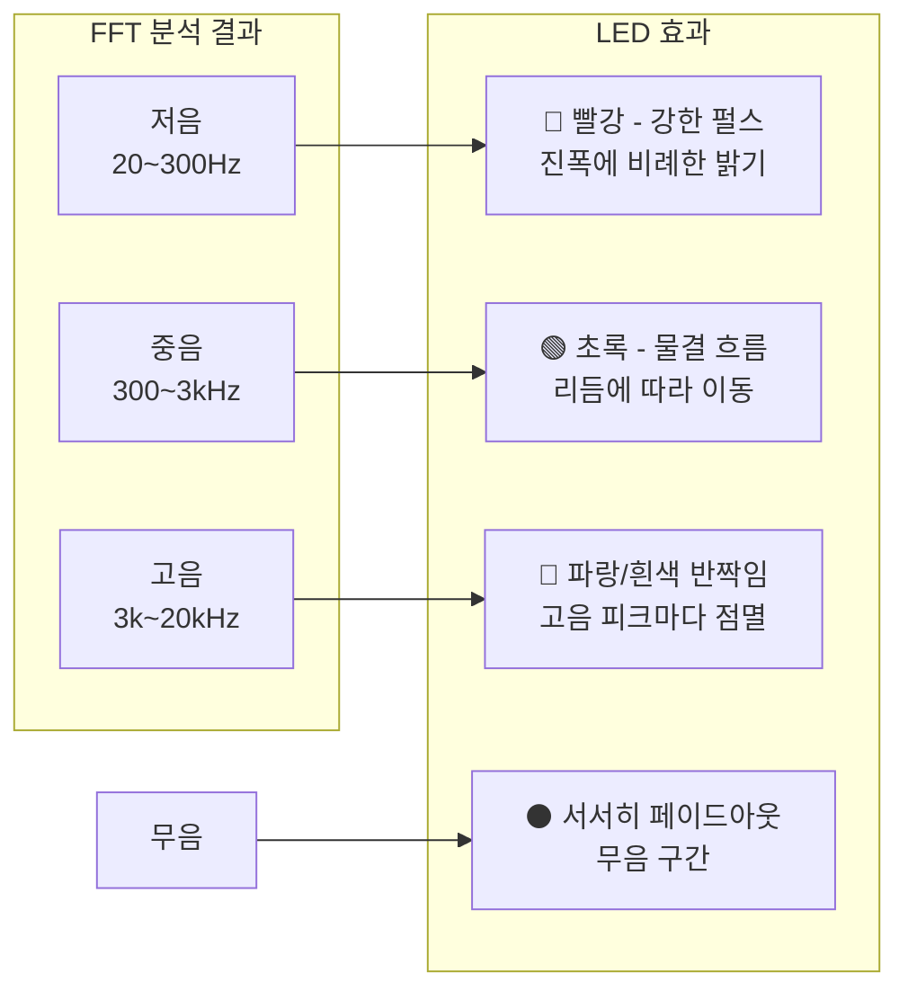
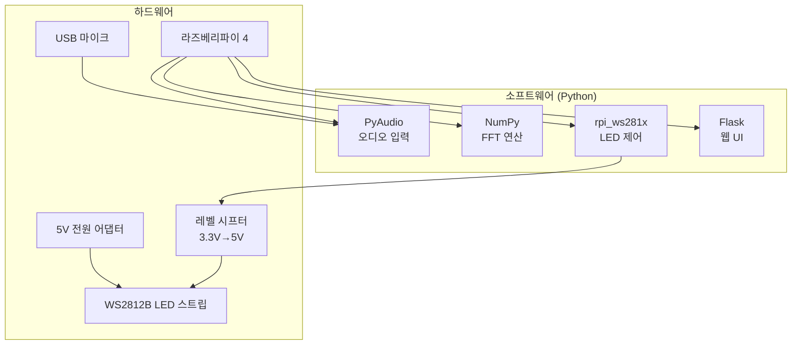

# 리듬에 반응하는 LED 조명 인터랙션 시스템
## 시스템 블럭도

---

## 주파수 → LED 매핑 상세

---

## 개발 구성 스택

# 리듬에 반응하는 LED 조명 인터랙션 시스템
### Rhythm-Reactive LED Lighting Interaction System

| 항목 | 내용 |
|------|------|
| 사용 플랫폼 | Raspberry Pi 4 |
| 개발 언어 | Python 3 |
| 총 개발 기간 | 8주 |
| 작성일 | 2026년 3월 |

---

## 1. 프로젝트 개요

### 1.1 프로젝트 배경 및 목적

현대인의 생활 공간에서 조명은 단순한 밝기 제공을 넘어 감성적 경험을 전달하는 매체로 발전하고 있다. 본 프로젝트는 음악의 리듬과 주파수를 실시간으로 분석하여 LED 조명이 자동으로 반응하는 인터랙티브 조명 시스템을 구현한다.

라즈베리파이 4를 메인 컨트롤러로 활용하여 마이크로 입력된 음원을 FFT(고속 푸리에 변환)로 분석하고, 저음/중음/고음 각 주파수 대역에 따라 WS2812B RGB LED 스트립의 색상, 밝기, 패턴을 실시간으로 제어한다. 또한 Flask 기반 웹 인터페이스를 통해 스마트폰에서 모드를 전환할 수 있다.

### 1.2 핵심 기술 스택

| 구분 | 기술/도구 | 역할 |
|------|-----------|------|
| 하드웨어 | Raspberry Pi 4, WS2812B LED, USB 마이크, 레벨 시프터 | 입력 수집 및 LED 물리 제어 |
| 신호처리 | PyAudio, NumPy FFT, Hanning Window | 실시간 오디오 분석 및 주파수 추출 |
| LED 제어 | rpi_ws281x 라이브러리 | RGB 색상·밝기·패턴 실시간 제어 |
| 웹 서버 | Flask, HTML/CSS/JavaScript | 모드 전환 웹 UI 제공 |
| 아키텍처 | Python multiprocessing + Queue | 오디오/LED/웹 서버 독립 프로세스 분리 |

### 1.3 주파수-LED 매핑 규칙

| 대역 | 주파수 범위 | LED 색상 | 반응 패턴 |
|------|-------------|----------|-----------|
| 저음 (Bass) | 20 ~ 300 Hz | 🔴 빨강 (Red) | 진폭 비례 강한 펄스 효과 |
| 중음 (Mid) | 300 Hz ~ 3 kHz | 🟢 초록 (Green) | 리듬에 따른 물결 흐름 효과 |
| 고음 (High) | 3 kHz ~ 20 kHz | 🔵 파랑/흰색 (Blue/White) | 고음 피크마다 반짝임 효과 |
| 무음 (Silence) | 임계값 이하 | ⚫ 소등 (Off) | 서서히 페이드아웃 |

---

## 2. 시스템 구성

### 2.1 하드웨어 구성 목록

| 부품명 | 사양 / 모델 | 수량 | 예상 비용 |
|--------|-------------|------|-----------|
| 라즈베리파이 4 | Model B, 4GB RAM, 64-bit quad-core | 1 | 기보유 |
| WS2812B LED 스트립 | 60LED/m, IP30, 5V 입력 | 1m | 약 10,000원 |
| USB 마이크 모듈 | 단방향 전방 지향성 마이크 | 1 | 약 5,000원 |
| 5V 전원 어댑터 x2 | RPi용 5V/3A, LED용 5V/10A | 2 | 약 10,000원 |
| 레벨 시프터 | 3.3V → 5V 신호 변환 | 1 | 약 1,000원 |
| 저항, 커패시터 | 330Ω 저항, 100uF/100nF 커패시터 | 다수 | 약 2,000원 |
| **합계** | | | **약 28,000원** |

### 2.2 소프트웨어 아키텍처

본 시스템은 Python의 multiprocessing 모듈을 기반으로 4개의 독립 프로세스로 구성된다. 각 프로세스는 Queue를 통해 데이터를 교환하며 GIL(Global Interpreter Lock) 문제를 회피하여 실시간 처리 성능을 극대화한다.

- **프로세스 1 - 오디오 캡처**: PyAudio로 마이크 입력을 실시간 수집, 버퍼 오버플로우 방지
- **프로세스 2 - FFT 분석**: Hanning 윈도우 적용 후 NumPy FFT로 주파수 대역별 에너지 계산
- **프로세스 3 - LED 제어**: rpi_ws281x로 30fps 기준 LED 색상/밝기/패턴 업데이트
- **프로세스 4 - Flask 웹서버**: 모드 전환 API 제공 및 실시간 주파수 데이터 스트리밍

---

## 3. 주차별 개발 계획 (8주)

### 🟢 Phase 1 — 환경 구성 및 기초 구현 (1~2주)

| 주차 | 단계 | 세부 작업 | 완료 기준 |
|------|------|-----------|-----------|
| 1주차 | 개발 환경 세팅 | - Raspberry Pi OS 설치 및 초기 설정 - Python 가상환경 및 패키지 설치 - WS2812B 테스트 (단순 색상 출력) - 전원 분리 배선 완료 | LED 단색 점등 성공 / 전원 안정 확인 |
| 2주차 | 마이크 입력 기초 구현 | - PyAudio USB 마이크 인식 및 테스트 - 기본 FFT 구현 (NumPy) - 주파수 스펙트럼 콘솔 출력 확인 - 저음/중음/고음 대역 분리 테스트 | FFT 주파수 분석 콘솔 출력 확인 |

### 🟠 Phase 2 — 핵심 기능 구현 (3~4주)

| 주차 | 단계 | 세부 작업 | 완료 기준 |
|------|------|-----------|-----------|
| 3주차 | 신호처리 고도화 | - Hanning 윈도우 함수 적용 - 노이즈 게이팅 (배경잡음 자동 학습) - 50% 오버랩 + 이동 평균 필터 적용 - 주파수별 에너지 정규화 처리 | 노이즈 환경에서도 안정적 분석 확인 |
| 4주차 | LED 반응 패턴 구현 | - 주파수-색상 매핑 로직 구현 - 저음 펄스 / 중음 물결 / 고음 반짝임 효과 - 무음 구간 페이드아웃 처리 - 30fps LED 업데이트 안정성 확인 | 음악에 맞춰 LED 실시간 반응 확인 |

### 🟣 Phase 3 — 기능 확장 및 통합 (5~6주)

| 주차 | 단계 | 세부 작업 | 완료 기준 |
|------|------|-----------|-----------|
| 5주차 | 웹 UI 개발 | - Flask 웹 서버 구축 및 API 설계 - 모드 전환 UI (음악반응/수동/무지개) - 모바일 반응형 웹 디자인 적용 - 색상 팔레트 및 밝기 슬라이더 구현 | 스마트폰에서 모드 전환 성공 |
| 6주차 | 멀티프로세싱 통합 | - 4개 프로세스 분리 구조 리팩토링 - multiprocessing Queue 기반 통신 구현 - 예외 처리 및 에러 핸들링 강화 - 시스템 전체 통합 테스트 | 전체 시스템 동시 구동 안정 확인 |

### 🔴 Phase 4 — 테스트 및 발표 준비 (7~8주)

| 주차 | 단계 | 세부 작업 | 완료 기준 |
|------|------|-----------|-----------|
| 7주차 | 성능 최적화 및 테스트 | - 오디오 처리 지연 측정 및 최적화 (목표 50ms 이하) - CPU 온도 모니터링 및 스로틀링 대응 - 다양한 음악 장르 테스트 (EDM, K-pop, 클래식) - 장시간 구동 안정성 테스트 (2시간 이상) | 지연 50ms 이하 / 장시간 안정 구동 확인 |
| 8주차 | 발표 준비 | - 발표용 음악 선정 및 시연 리허설 - 시연 플로우 설계 (수동→무지개→음악반응 순서) - 외부 스피커 준비 및 발표 환경 점검 - 최종 보고서 및 PPT 자료 완성 | 발표 리허설 2회 이상 완료 |

---

## 4. 팀원 역할 분담

| 조원 | 담당 역할 | 주요 업무 | 담당 주차 |
|------|-----------|-----------|-----------|
| 조원 1 | 하드웨어 / 회로 | - 부품 구매 및 회로 배선 - 전원 분리 설계, 레벨 시프터 연결 - WS2812B 동작 테스트 및 노이즈 대응 | 1~2주차, 7주차 |
| 조원 2 | 소프트웨어 / Python | - 멀티프로세싱 아키텍처 설계 및 구현 - LED 제어 로직 및 예외 처리 코드 작성 - 전체 시스템 통합 및 성능 최적화 | 3~6주차, 7주차 |
| 조원 3 | 신호처리 / FFT | - Hanning 윈도우 및 FFT 파이프라인 구현 - 노이즈 게이팅 및 주파수 정규화 - 대역별 필터뱅크 최적화 | 2~4주차, 7주차 |
| 조원 4 | UI / 발표 | - Flask 웹 UI 설계 및 모바일 반응형 구현 - 발표 자료(PPT), 보고서 작성 - 발표 시연 플로우 및 리허설 진행 | 5주차, 8주차 |

---

## 5. 기대 효과 및 차별화 포인트

| 구분 | 내용 |
|------|------|
| 기술적 성취 | 실시간 DSP(디지털 신호처리) + 임베디드 시스템 통합 경험 / Python 멀티프로세싱 아키텍처 설계 역량 |
| 시연 임팩트 | 음악에 즉각 반응하는 LED 시각화로 발표 현장에서 강렬한 인상 제공 / 스마트폰 모드 전환 데모로 IoT 완성도 증명 |
| 확장 가능성 | BPM 감지 기능, 블루투스 스피커 연동, OpenCV 기반 주변 색온도 자동 매핑 등 추가 기능으로 발전 가능 |
| 실용성 | 가정, 카페, 공연장 등 실생활 환경에 즉시 적용 가능한 완성도 높은 제품 프로토타입 |

---

> 본 프로젝트는 하드웨어, 신호처리, 소프트웨어, UI가 유기적으로 결합된 완성도 높은 임베디드 시스템입니다.
