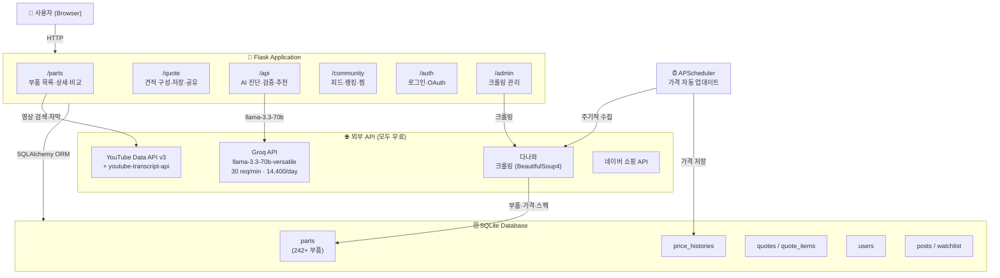
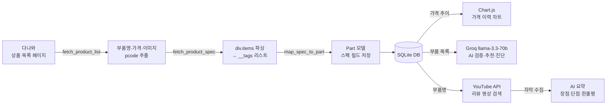
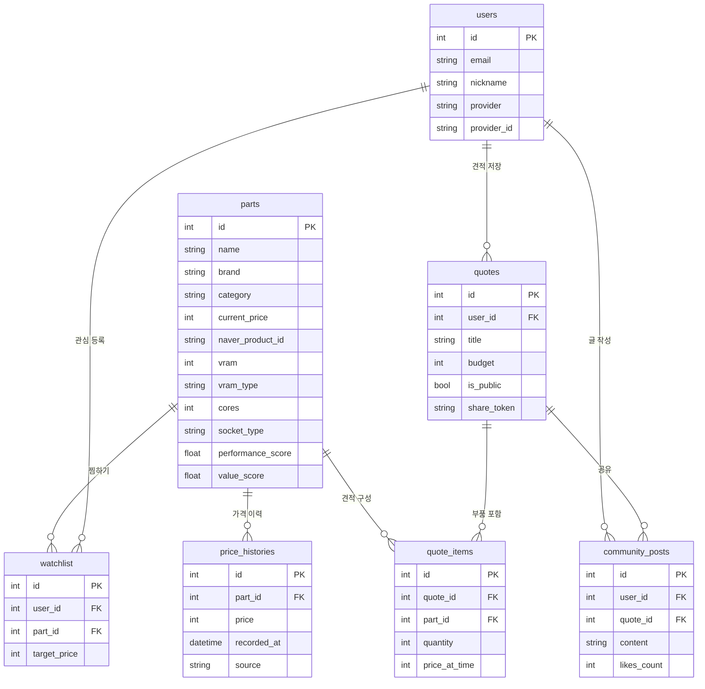

# 🖥️ 견피티 (GeonPiTi)

> **AI & YouTube 기반 PC 부품 종합 정보 플랫폼**  
> 캡스톤 디자인 2026년 1학기 | 혼자서도 완벽한 PC 견적을 짤 수 있는 서비스  
> **총 추가 비용: 0원** (모든 외부 API 무료 플랜 활용)

---

## 📌 프로젝트 개요

견피티는 PC 부품 구매를 처음 접하는 사용자도 쉽게 최적의 견적을 구성할 수 있도록 돕는 플랫폼입니다.  
다나와 실시간 크롤링으로 수집한 부품 데이터와 Groq LLM, YouTube Data API를 결합해  
**AI 기반 진단·추천·리뷰 요약** 기능을 제공합니다.

---

## 🏗️ 시스템 아키텍처



---

## 🔄 데이터 흐름



---

## ✨ 주요 기능

### 🔩 부품 정보 시스템
- GPU / CPU / RAM / MB / SSD / PSU / CASE / COOLER **8개 카테고리 242+ 부품**
- 다나와 실시간 크롤링 — 가격·스펙·이미지 자동 수집 (APScheduler)
- 신품/중고 **가격 이력 차트** (Chart.js, 30일/90일/180일)
- 시리즈 내 **유사 부품 비교** 테이블 (성능 점수 기반)
- 글로벌 **실시간 검색** 드롭다운

### 🤖 AI 기능

| 기능 | 엔드포인트 | 설명 |
|------|-----------|------|
| 내 부품 진단 | `POST /api/ai-diagnose` | 현재 스펙 → 업그레이드 우선순위 3개 + DB 부품 연결 |
| 견적 AI 검증 | `POST /api/ai-validate` | 호환성 · 병목 지수(0~10) · 가성비 점수(0~100) |
| 자연어 추천 | `POST /api/ai-recommend` | "50만원으로 롤 하고 싶어요" → 부품 조합 추천 |
| 유튜브 리뷰 요약 | `GET /api/review-summary` | 자막 수집 → 장점/단점/한줄 요약 AI 생성 |

> **AI 전환 이력**: Ollama(로컬) → Google Gemini API(무료 quota=0 문제) → **Groq API** (현재)

### 📋 견적 구성
- 드래그&드롭 방식 8개 슬롯 부품 선택
- 용도별 프리셋 (게이밍 / 영상편집 / 개발 / 사무)
- AI 검증 버튼 — 실시간 호환성·병목·가성비 분석
- 견적 저장 및 URL 공유

### 👥 커뮤니티
- 견적 공유 피드 & 좋아요 & 댓글
- 카테고리별 인기 부품 랭킹 (찜 수 기반)
- 관심 부품 Watchlist

---

## 🛠️ 기술 스택

| 분류 | 기술 |
|------|------|
| **Backend** | Python 3.12, Flask 3.0, SQLAlchemy, Flask-Login, Flask-Migrate |
| **Database** | SQLite (개발) |
| **Frontend** | Jinja2, Vanilla JS, Chart.js, CSS Variables (다크모드 대응) |
| **AI** | Groq API — `llama-3.3-70b-versatile` (무료 30 req/min) |
| **크롤링** | BeautifulSoup4, lxml, requests |
| **스케줄링** | APScheduler |
| **인증** | Flask-Login + Google OAuth 2.0 |
| **YouTube** | YouTube Data API v3 + youtube-transcript-api |
| **배포** | Ubuntu 22.04 (VMware), Python venv |

---

## 📁 프로젝트 구조

```
geonpiti/
├── app/
│   ├── __init__.py              # Flask 앱 팩토리
│   ├── models/
│   │   ├── part.py              # Part, PriceHistory, UsedPriceHistory
│   │   ├── user.py              # User (Google OAuth)
│   │   ├── quote.py             # Quote, QuoteItem
│   │   └── community.py        # Post, Like, Watchlist
│   ├── routes/
│   │   ├── main.py              # 메인 페이지, 통계 API
│   │   ├── parts.py             # 부품 목록/상세/비교/검색
│   │   ├── quote.py             # 견적 구성/저장/공유
│   │   ├── community.py        # 피드/랭킹/찜
│   │   ├── auth.py              # 로그인/로그아웃/Google OAuth
│   │   ├── ai.py                # AI 진단/검증/추천/리뷰 API
│   │   └── admin.py             # 크롤링·스펙재수집 관리 페이지
│   ├── services/
│   │   ├── danawa_crawler.py    # 다나와 크롤러 (목록+스펙+가격)
│   │   ├── gemini_service.py    # Groq API 클라이언트 (내부 교체)
│   │   ├── ai_diagnose.py       # 내 부품 진단 / 견적 검증 로직
│   │   ├── ai_recommend.py      # 자연어 견적 추천 로직
│   │   ├── ai_review.py         # YouTube 리뷰 요약 로직
│   │   ├── youtube_api.py       # YouTube Data API + 자막 수집
│   │   ├── naver_api.py         # 네이버 쇼핑 API
│   │   └── scheduler.py         # APScheduler 가격 자동 업데이트
│   ├── templates/
│   │   ├── base.html            # 공통 레이아웃 (네비/푸터/다크모드)
│   │   ├── main/index.html      # 메인 페이지
│   │   ├── parts/               # 목록/상세/비교
│   │   ├── quote/               # 견적 구성/저장
│   │   ├── community/           # 피드/랭킹
│   │   ├── auth/                # 로그인
│   │   └── ai/diagnose.html     # AI 진단 페이지
│   └── static/
│       ├── css/style.css        # 전체 스타일 (CSS 변수 기반)
│       ├── js/main.js           # 공통 JS (검색, 차트, 호환성 체크)
│       ├── manifest.json        # PWA 설정
│       └── sw.js                # Service Worker
├── run.py
├── requirements.txt
└── .env.example
```

---

## 🚀 설치 및 실행

### 1. 환경 변수 설정

```bash
cp .env.example .env
```

`.env` 파일에 아래 값을 채워주세요:

```env
SECRET_KEY=your-secret-key
DATABASE_URL=sqlite:///geonpiti.db

# Groq API (무료: https://console.groq.com)
GROQ_API_KEY=your-groq-api-key

# YouTube Data API v3 (무료: Google Cloud Console)
YOUTUBE_API_KEY=your-youtube-api-key

# 네이버 쇼핑 API (무료: https://developers.naver.com)
NAVER_CLIENT_ID=your-naver-client-id
NAVER_CLIENT_SECRET=your-naver-client-secret

# Google OAuth (선택)
GOOGLE_CLIENT_ID=your-google-client-id
GOOGLE_CLIENT_SECRET=your-google-client-secret
GOOGLE_REDIRECT_URI=http://localhost:5000/auth/google/callback
```

### 2. 패키지 설치

```bash
python3 -m venv venv
source venv/bin/activate
pip install -r requirements.txt
```

### 3. DB 초기화

```bash
flask db init
flask db migrate -m "init"
flask db upgrade
```

### 4. 서버 실행

```bash
flask run --host=0.0.0.0 --port=5000
```

### 5. 데이터 수집

`http://localhost:5000/admin/` 접속 후:
1. **🚀 전체 크롤링 시작** — 8개 카테고리 부품 수집
2. **🔬 전체 스펙 재수집** — 스펙 파싱 (약 10분 소요)
3. **📈 가격 이력 초기화** — 가격 추이 차트 즉시 표시

---

## 🗺️ API 엔드포인트

| Method | URL | 설명 |
|--------|-----|------|
| GET | `/` | 메인 페이지 |
| GET | `/parts/` | 부품 목록 (카테고리·정렬 필터) |
| GET | `/parts/<id>` | 부품 상세 (스펙·차트·AI 요약) |
| GET | `/parts/<id>/compare` | 시리즈 비교 |
| GET | `/parts/search` | 부품 검색 API |
| GET | `/parts/<id>/price-history` | 가격 이력 API (Chart.js용) |
| GET | `/quote/` | 견적 구성 빌더 |
| POST | `/quote/save` | 견적 저장 |
| GET | `/ai/diagnose` | AI 부품 진단 페이지 |
| POST | `/api/ai-diagnose` | AI 진단 API |
| POST | `/api/ai-validate` | 견적 AI 검증 API |
| POST | `/api/ai-recommend` | 자연어 견적 추천 API |
| GET | `/api/review-summary` | YouTube 리뷰 요약 API |
| GET | `/community/feed` | 커뮤니티 피드 |
| GET | `/community/ranking` | 인기 랭킹 |
| POST | `/admin/crawl/all` | 전체 크롤링 실행 |
| POST | `/admin/rescrape` | 스펙 재수집 |
| POST | `/admin/seed-price-history` | 가격 이력 초기화 |

---

## 🧩 핵심 기술 문제 해결

### 다나와 HTML 구조 변경 대응

다나와 스펙 페이지 HTML 구조가 변경되어 기존 파서가 동작하지 않는 문제를 해결했습니다.

```
(구) <table class="spec-list"><tr><th>코어 수</th><td>8코어</td></tr>...
(신) <div class="items">인텔(소켓1851) / P6+E12코어 / 기본 클럭 : 4.2GHz / ...
```

`div.items` 텍스트를 `/` 구분자로 분할 후 `:` 포함 여부로 key:value와 `__tags`로 이중 저장하고, `map_spec_to_part`에서 정규식으로 파싱합니다.

```python
# GPU VRAM: 부품명에서 추출
vram_m = re.search(r'(\d+)\s*GB', part.name)

# 권장 파워: __tags에서 추출  
m = re.search(r'정격파워\s*(\d+)', tags_text)

# CPU P/E코어: 복합 정규식
pe = re.search(r'P(\d+)\+E(\d+)코어', tags_text)
```

---

## 📊 데이터베이스 스키마



---

## ⚙️ 실행 환경

| 항목 | 내용 |
|------|------|
| OS | Ubuntu 22.04 (VMware Workstation) |
| Python | 3.12 |
| 웹 프레임워크 | Flask 3.0.3 |
| DB | SQLite |
| AI | Groq API — llama-3.3-70b-versatile |
| 추가 비용 | **0원** |

---

## 📝 라이선스

캡스톤 디자인 프로젝트 — 학술 목적 사용만 허용

---

*© 2026 견피티 (GeonPiTi) | 캡스톤 디자인 2026년 1학기*
